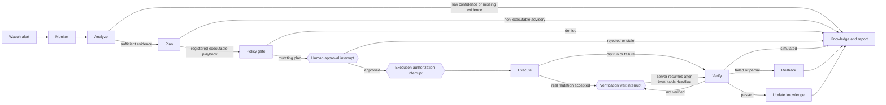

# Controlled MAPE-K Security Workflow

TSAGE formal investigations run through one explicit LangGraph MAPE-K state
machine. The workflow is evidence-driven, uses code-owned playbooks and
registries, separates approval from execution, and verifies an action before it
can be reported as successful.

SOC L1, L2, and L3 are human RBAC roles. They are not autonomous agents. The
SOC assistant is a bounded capability router around the formal workflow, not a
second response engine.

## Runtime architecture



The two interrupt nodes are intentionally separate:

1. An approver records an approve or reject decision.
2. An independently authorized executor atomically claims the exact approved
   actions and resumes execution.

An approval does not execute an action.

## Stages and statuses

`WorkflowStage` represents the processing phase. Human approval and execution
authorization are LangGraph interrupt nodes, not additional stage enum values.

| Stage | Responsibility |
| --- | --- |
| `monitor` | Load the selected Wazuh alert, correlate a bounded time window, normalize and deduplicate events, and create evidence references. |
| `analyze` | Produce an evidence-bound diagnosis. Deterministic SSH rules run before the bounded semantic fallback. |
| `plan` | Build a registered executable remediation plan when one fits; otherwise produce a typed, non-executable advisory plan for human handling. |
| `policy_gate` | Validate evidence references, plan integrity, registry versions, targets, protected resources, rollback coverage, risk, and required role. |
| `execute` | Run only the registered restricted adapter after a durable action claim and execution authorization. |
| `verify` | Observe post-action security and service health. An accepted provider request is not treated as a verified outcome. |
| `rollback` | Run the exact rollback mapped to a forward action that may have changed state. |
| `update_knowledge` | Build and persist the final deterministic report for verified outcomes, escalations, and advisory plans. |

`WorkflowStatus` is orthogonal to the stage:

| Status | Meaning |
| --- | --- |
| `created` | Initial state exists but processing has not started. |
| `queued` | Reserved for queued execution paths. |
| `running` | The current processing stage is active. |
| `waiting_approval` | The graph is paused at the human approval interrupt. `awaiting_approval` is a compatibility alias that serializes to the same value. |
| `approved` | A valid human decision exists; the graph is or will be paused for separate execution authorization. |
| `completed` | Required post-action security and health checks passed and knowledge was updated. |
| `rejected` | The approver rejected the plan. |
| `escalated` | Evidence, policy, verification, or another safety condition requires human handling. |
| `failed` | A workflow stage failed. Public failure messages contain a stage and exception type, not raw provider secrets or stack traces. |
| `cancelled` | Reserved for a cancelled workflow. |

Low-confidence or incomplete analysis does not advance to planning. Policy
denial, simulated verification, and unverifiable outcomes do not become
`completed`.

## Monitor and analyze

For an SSH authentication alert, Monitor:

- fetches the primary alert and related authentication alerts in the exact
  configured start and end timestamps;
- limits correlation to SSH authentication event types instead of collecting
  unrelated process, network, port, and OS inventory;
- normalizes and deduplicates the returned alerts;
- records the search window, total hits, returned hits, and truncation state;
- aggregates failures, successes, users, source IPs, affected assets, and
  success-after-failure observations; and
- marks missing source, user, asset, reputation, or truncated evidence.

The default correlation window is controlled by
`MAPEK_CORRELATION_WINDOW_SECONDS`. SSH brute-force, password-spray, and
success-after-failure thresholds are independently configurable through the
`MAPEK_SSH_*` settings.

Analyze first applies deterministic classifications:

- `ssh_login_failure`
- `ssh_invalid_user_attempt`
- `ssh_brute_force`
- `ssh_password_spraying`
- `ssh_login_success`
- `ssh_success_after_failures`

A single failed login does not satisfy the brute-force threshold. It remains a
lower-confidence observation that needs more evidence. A successful login
after failures is reported as an observed sequence, not as proof of account
compromise.

If no deterministic diagnosis matches, the analyzer may call the centralized
Oxy provider with bounded JSON context and strict structured output. Every
diagnosis must reference existing evidence IDs. Unknown evidence references are
rejected deterministically.

## Evidence identity and provenance

Each normalized alert produces an `EvidenceReference` containing:

- a stable `EV-*` evidence ID;
- `source_type=wazuh_alert`;
- a resolvable source reference such as `wazuh:alert:<alert-id>`;
- the observation timestamp and bounded summary; and
- a SHA-256 hash of the normalized alert payload.

The incident `evidence_version` is a SHA-256 hash over the sorted normalized
evidence hashes. Diagnoses, actions, plans, approvals, and execution claims are
bound to that version. A change in evidence therefore invalidates an older
approval.

PostgreSQL stores compact normalized-evidence provenance: source type, Wazuh
index pattern, document ID, source reference, normalized hash, normalizer name
and version, observation and ingestion timestamps, event count, organization,
and bounded attack details. The checkpoint does not duplicate the normalized
alert payload inside the evidence record. Bulk raw telemetry remains in Wazuh.

This is not yet a complete forensic chain of custody. The exact concrete source
index and raw document hash are unavailable on the current normalized search
result contract and remain explicit null or pattern-level metadata.

## Attack-agnostic advisory planning

Any sufficiently confident, evidence-bound diagnosis can reach Plan. Planning
has two deliberately different outputs:

- `RemediationPlan` is executable only when an exact code-owned playbook can be
  built and independently validated by the policy engine.
- `AdvisoryPlan` is available for every other diagnosis. It contains cited
  evidence IDs and human-reviewed investigation, containment, eradication,
  recovery, and detection recommendations. Its contract fixes
  `executable=false` and `human_review_required=true`.

The planning model may recommend analyst work, but it cannot place commands,
targets, or actions into the executor. If the model is unavailable, the planner
still returns deterministic incident-response guidance. If a model invents a
playbook, or a registered playbook cannot safely bind to the diagnosed entities,
the result is downgraded to an advisory rather than guessed or executed.

This makes analysis and response guidance attack-agnostic without pretending
that arbitrary attacks are safe to remediate automatically. New automation is
added only by registering and testing a narrow reversible playbook.

## Immutable remediation plans

`RemediationPlan` contains the plan ID and version, playbook ID and version,
incident ID, evidence version, policy version, action catalogue version,
creation and expiry timestamps, risk, exact actions, preconditions, expected
effects, verification checks, rollback actions, and required approval role.

The plan hash is computed over the canonical security-relevant payload,
including:

- the exact ordered actions, targets, parameters, timeouts, and TTLs;
- rollback actions;
- risk, preconditions, and verification checks;
- required role;
- playbook ID and version;
- incident and plan versions; and
- evidence, policy, and action catalogue versions.

Pydantic recomputes the canonical hash and rejects a supplied hash that does not
match. The generated plan ID also includes that hash. Approval and execution
never rely on a mutable display summary.

## Code-owned registries

The model cannot invent an action, adapter, verification check, or playbook.
The current registries publish only the following response surface.

### Action catalogue `1.0`

| Action | Restricted adapter | Minimum role | Rollback |
| --- | --- | --- | --- |
| `block_ip` | Wazuh Active Response `firewall-drop` | `soc_l2` | `unblock_ip` |
| `unblock_ip` | Wazuh Active Response `firewall-drop-delete` | `soc_l2` | None |
| `disable_user` | Wazuh Active Response `disable-account` | `soc_l3` | `enable_user` |
| `enable_user` | Wazuh Active Response `disable-account-delete` | `soc_l3` | None |

Arbitrary `command`, `shell`, and `argv` parameters are prohibited.
Playbook validation also enforces the published parameter allowlist.

### Verification catalogue `1.0`

| Check | Category | Default |
| --- | --- | --- |
| `ssh_attempts_stopped` | Security | Required |
| `no_new_critical_alerts` | Security | Required |
| `no_new_auth_success_for_user` | Security | Required for account containment |
| `wazuh_agent_connected` | Health | Required |
| `ssh_port_listening` | Health | Required |
| `management_ssh_reachable` | Health | Optional unless required by configuration |

### Playbook registry

The currently published executable playbooks are:

- `ssh-bruteforce-v1@1.0`: temporary source-IP containment for
  `ssh_brute_force`;
- `ssh-password-spray-v1@1.0`: temporary source-IP containment for
  `ssh_password_spraying`; and
- `credential-compromise-v1@1.0`: single-account disablement for
  `ssh_success_after_failures`.

Each requires one exact rollback mapped to its forward action and its published
security and health checks. Other action enum values are schema vocabulary only;
they have no registered executor and cannot pass the policy gate.

## Policy gate

The deterministic policy engine rejects a plan when any of these checks fail:

- diagnosis confidence is below
  `MAPEK_ANALYSIS_CONFIDENCE_THRESHOLD`;
- diagnosis or action evidence IDs are missing or unknown;
- incident, evidence, policy, or action catalogue versions do not match;
- the plan is expired or its canonical hash is invalid;
- the playbook, action, rollback, parameters, or verification checks are not
  registered exactly;
- a mutating action has no rollback;
- the block target differs from the evidence-bound diagnosed source IP;
- the target is protected or an approved administrative IP;
- a temporary block has no TTL; or
- the declared plan risk is lower than an action's risk.

The effective approval role is the higher of the playbook role and the minimum
role registered for its actions. Every currently registered mutating action
requires approval.

The policy engine does not itself implement maintenance-window scheduling,
backup/snapshot orchestration, or a general organization policy language.
Target-level conflict control is enforced at the execution service boundary
with durable resource leases after approval and before the final policy
recheck.

## Approval trust boundary

FastAPI verifies a Clerk session token and derives the personal scope, user ID,
and roles on the server. The browser cannot submit an approver or executor
identity.

The approval request body contains only:

```json
{
  "approval_id": "APR-...",
  "decision": "approve",
  "comment": "Validated source and containment scope."
}
```

The server constructs `TrustedApprovalSubmission` with `actor_user_id` and
`actor_roles` from the verified Clerk principal. Approval requires at least one
of `soc_l2`, `soc_l3`, or `security_admin`, configured by Clerk user ID.

An approval record is bound to:

- investigation and incident IDs;
- approval ID and expiry;
- plan ID, integer version, and canonical hash;
- evidence version;
- policy version;
- action catalogue version;
- the exact ordered action IDs; and
- the required role.

The graph rejects stale, expired, cross-investigation, cross-incident, or
role-incompatible decisions. After a valid approval, the graph pauses again at
the execution authorization interrupt.

Execution is a separate request:

```json
{
  "approval_id": "APR-..."
}
```

`POST /api/v1/investigations/{id}/execute` requires the verified Clerk user to
be listed in `CLERK_EXECUTOR_USER_IDS`. The server injects the executor identity
and roles, revalidates the plan binding and current policy, and authorizes only
the exact claimed action IDs.

## Execution and idempotency

### Dry-run mode

Dry run is the default. The executor records the intended target, expiry, and
rollback mapping but does not call Wazuh Active Response. Redis provides an
advisory, fail-soft idempotency claim for this non-mutating path.

Execution results use `status=dry_run`. Verification uses
`outcome=simulated`, sets both security and health success flags to false, and
does not mark remediation complete.

### Real mode

The formal MAPE-K executor considers real execution enabled only when all five
conditions are true:

```env
MAPEK_EXECUTION_MODE=enabled
MAPEK_REAL_EXECUTION_ENABLED=true
MAPEK_DRY_RUN=false
WAZUH_READ_ONLY=false
WAZUH_ALLOW_DANGEROUS_TOOLS=true
```

Real execution additionally requires:

- a durable PostgreSQL action repository;
- an approved before-state provider;
- a numeric Wazuh agent ID;
- a valid, unexpired, immutable approval;
- a separate executor identity;
- an atomic claim for the exact action set; and
- a registered restricted adapter.

The default `InvestigationService` currently supplies the durable repository
but does not wire a before-state provider. Consequently, real execution fails
closed until that provider is implemented and connected.

The legacy direct Wazuh response routes are retained only as compatibility
stubs and always return a conflict response. `MAPEK_EXECUTION_MODE` does not
enable them. Mutations can only enter through the formal approval and execution
workflow.

### Durable claims

Before resuming the execution interrupt, the SQL repository uses a transaction
and row locks to:

- load the current approval in the authenticated personal scope;
- validate its status, expiry, plan hash, and evidence version;
- compare the complete expected action ID set;
- reject invalidated, missing, stale, or already incompatible actions; and
- atomically assign one execution ID and executor to the claimed rows.

Each action then transitions under a row lock before the external call.
Completed or already-running actions are not executed again. Retryable failures
and timeouts may be retried only within `MAPEK_MAX_EXECUTION_RETRIES`.

This provides durable per-action idempotency. The repository also implements
durable incident/resource lease records with token ownership, renewal, expiry,
and stale takeover. Trusted graph resumes acquire the incident lease.
`InvestigationService.execute_approved()` also locks canonical targets in a
shared Wazuh-environment namespace before the durable action claim. A target
lease for accepted temporary containment remains active until its TTL so
another user's workflow cannot mutate the same resource.

Wazuh Active Response acknowledgement is recorded as `accepted`, not `applied`
or `verified`. Only the Verify stage can establish the final outcome.

Temporary-action expiry and rollback lifecycle are durable in PostgreSQL. The
repository can atomically claim overdue actions, recover stale rollback claims,
enforce bounded retries, and complete a claim only with its token. The
`recover_expired_temporary_actions()` service exposes a disabled-by-default
scheduler boundary with a stable rollback idempotency key. A concrete Wazuh
rollback-and-verification adapter and scheduler/outbox are still required
before restart recovery is operational.

## Verification and rollback

Real verification begins after the successful execution result and an
immutable `verification_not_before` deadline derived from
`MAPEK_VERIFICATION_OBSERVATION_SECONDS`. The graph persists and pauses at a
`verification_wait` interrupt. Only the executor-protected server endpoint can
resume it, and early resumes are rejected. Verification checks Wazuh telemetry
after the execution timestamp, not the original alert window.

The current SSH verifier checks:

- no further matching SSH attempts from the contained source;
- no new critical alerts in the observation window;
- the target Wazuh agent remains connected;
- SSH port 22 remains listening; and
- optionally, management-plane SSH reachability.

Truncated post-action telemetry cannot prove attack cessation and produces a
partial result. A verification exception, failed check, or partial required
check escalates and routes to rollback. Simulated or otherwise unverifiable
outcomes never claim remediation success.

Rollback considers only forward actions with a status that could have mutated
state (`accepted`, `applied`, or `executed`). Dry runs, duplicates, and failed
forward actions are not rolled back. The rollback action must be the exact
registered inverse with the exact `reverts_action_id` mapping.

## SSH brute-force sequence

```mermaid
sequenceDiagram
    actor Analyst
    participant API as FastAPI
    participant Auth as Clerk verification
    participant Service as InvestigationService
    participant Graph as LangGraph MAPE-K
    participant Wazuh
    participant DB as PostgreSQL
    participant Redis
    actor Approver
    actor Executor

    Analyst->>API: POST /investigations (alert_id, agent_id)
    API->>Auth: Verify session token
    Auth-->>API: user_id, personal scope, roles
    API->>Service: start investigation
    Service->>DB: persist initial snapshot
    Service->>Graph: invoke(thread_id=investigation_id)
    Graph->>Wazuh: primary alert and bounded auth correlation
    Wazuh-->>Graph: alerts plus total/returned/truncated metadata
    Graph->>Graph: normalize, hash, diagnose, plan, policy
    Graph->>DB: checkpoint and evidence/report projections
    Graph->>Redis: fail-soft cache and activity
    Graph-->>Service: interrupt human_approval
    Service-->>Analyst: waiting_approval plus immutable binding

    Approver->>API: POST /approval (approval_id, decision, comment)
    API->>Auth: Verify approver session and role
    API->>Service: submit trusted actor identity
    Service->>Graph: resume human_approval
    Graph->>Graph: validate plan/evidence/version/expiry/role
    Graph->>DB: persist approval decision and checkpoint
    Graph-->>Service: interrupt execution_authorization
    Service-->>Approver: approved; no action executed

    Executor->>API: POST /execute (approval_id)
    API->>Auth: Verify executor allowlist
    API->>Service: execute with trusted executor identity
    Service->>DB: lock shared Wazuh resources and atomically claim actions
    DB-->>Service: execution_id and action_ids
    Service->>Graph: resume execution_authorization
    Graph->>Graph: revalidate binding and fresh policy
    alt dry run
        Graph->>Graph: record simulated action
        Graph->>Graph: verification outcome simulated
    else real execution prerequisites satisfied
        Graph->>Wazuh: allowlisted firewall-drop Active Response
        Wazuh-->>Graph: accepted or error
        Graph-->>Service: interrupt until immutable verification deadline
        Executor->>API: POST /verification/resume after deadline
        Graph->>Wazuh: observe post-action alerts and health
        Wazuh-->>Graph: verification evidence
        alt required checks pass
            Graph->>Graph: update knowledge as completed
        else failed or partial
            Graph->>Wazuh: exact firewall-drop-delete rollback
            Graph->>Graph: escalate
        else not verified
            Graph->>Graph: remain pending without success claim
        end
    end
    Graph->>DB: persist results, report, audit projection, checkpoint
    Graph->>Redis: publish fail-soft activity events
    Service-->>Executor: final snapshot
```

## Persistence and restart behavior

PostgreSQL is the production source of truth for:

- LangGraph checkpoints;
- investigation snapshots;
- normalized evidence records;
- approvals and immutable plan bindings;
- response action claims, results, retries, and expiry metadata;
- investigation state versions and resource lease records;
- reports; and
- audit-event projections.

Redis is fail-soft and holds short-lived correlation and analysis caches,
activity streams, rate limits, and advisory idempotency data. Losing Redis does
not remove PostgreSQL investigations or durable action claims.

`InvestigationService` obtains its checkpointer from
`create_investigation_checkpointer()`:

- `MAPEK_CHECKPOINTER_BACKEND=auto` selects PostgreSQL when `DATABASE_URL` is
  configured;
- `postgres` requires `DATABASE_URL`;
- `memory` is allowed only outside production and only when
  `MAPEK_ALLOW_INMEMORY_CHECKPOINTER=true`; and
- `ENVIRONMENT=production` refuses to start investigations without the
  PostgreSQL checkpointer.

With PostgreSQL checkpoints initialized, the graph thread ID is the
investigation ID. Approval and execution interrupts can therefore survive a
FastAPI process restart and resume from the saved checkpoint.

The repository snapshot fallback supports reads when a checkpoint cannot be
loaded. It does not reconstruct LangGraph interrupt state and is not a
substitute for a durable checkpointer. An in-memory checkpointer loses resumable
workflow state on process restart. Direct calls to `create_mape_k_graph()`
without an explicit checkpointer also default to memory and are intended for
tests or isolated development.

Audit events are projected to dedicated PostgreSQL rows. Checkpoint state keeps
only the most recent 64 events through a bounded reducer. Moving to event IDs
and an immediate node-level audit writer would reduce it further.

Checkpoint state no longer duplicates proposed actions or execution views;
those compatibility views are derived from the plan and execution results at
the service boundary. Evidence records no longer duplicate normalized alert
payloads. The state still retains normalized alerts, evidence references,
compact provenance, and findings, so high-volume size measurement remains
necessary.

Investigation snapshots have an optimistic `state_version`, and both SQL and
in-memory repositories reject stale compare-and-swap writes. The service loads
the authoritative version and supplies it on every snapshot projection; direct
graph use outside `InvestigationService` remains a test-only boundary.

## Database setup and migration

From `Backend/`, start storage and initialize both application and LangGraph
schemas:

```bash
make storage-up
make storage-init
```

`make storage-init` runs `alembic upgrade head`, then initializes
`PostgresSaver` and `PostgresStore`. The safety-binding migration
`20260725_12_mapek_safety_bindings.py` adds plan, evidence, policy, catalogue,
invalidation, rollback, expiry, and retry fields to approvals and response
actions.

Recommended production checkpoint settings are:

```env
ENVIRONMENT=production
DATABASE_URL=postgresql+psycopg://...
DATABASE_AUTO_CREATE=false
DATABASE_REQUIRED=true
MAPEK_CHECKPOINTER_BACKEND=postgres
MAPEK_ALLOW_INMEMORY_CHECKPOINTER=false
```

Run migrations as an explicit deployment step. `DATABASE_AUTO_CREATE=true` is
a development convenience, not a replacement for reviewed migrations.

Keep the response path safe by default:

```env
MAPEK_EXECUTION_MODE=disabled
MAPEK_DRY_RUN=true
MAPEK_REAL_EXECUTION_ENABLED=false
WAZUH_READ_ONLY=true
WAZUH_ALLOW_DANGEROUS_TOOLS=false
```

Human roles remain server-owned Clerk user allowlists:

```env
CLERK_SOC_L2_USER_IDS=
CLERK_SOC_L3_USER_IDS=
CLERK_SECURITY_ADMIN_USER_IDS=
CLERK_AUDITOR_USER_IDS=
CLERK_EXECUTOR_USER_IDS=
```

## Migration map

| Previous component | Current decision | Replacement |
| --- | --- | --- |
| L1/L2/L3 runtime agents | Retired from formal response runtime | Explicit MAPE-K graph stages |
| Tier supervisors and subgraphs | Retired from formal response runtime | Deterministic conditional graph edges |
| Tier-agent conversation endpoint | Returns HTTP 410 | Formal investigation API |
| SOC assistant | Kept as a bounded router | Allowlisted reads, questions, and workflow operations |
| Multi-provider agent pool | Retired from formal workflow | One lazy Oxy provider for bounded semantic fallback |
| Per-tier tool loops | Retired from formal workflow | Deterministic Monitor, Analyze, Plan, Policy, Execute, Verify, and Knowledge implementations |
| Wazuh gateway and normalizers | Kept and hardened | Timestamp-bounded evidence acquisition and normalization |
| PostgreSQL repository/checkpointer | Kept and hardened | Durable checkpoints, plan bindings, claims, evidence, and reports |
| Redis facade | Kept as optional coordination | Fail-soft cache, activity, rate limit, and advisory idempotency |
| Approval and execution | Split and hardened | Server-derived approver plus separately allowlisted executor |
| Response credentials | Kept isolated | `RestrictedExecutor` and registered Wazuh adapters only |

## SOC assistant

The assistant's server-owned catalog drives API validation and frontend slash
commands:

- `/alerts` returns compact, correlated Wazuh findings.
- `/summary` returns bounded alert distributions.
- `/hunt` searches local Wazuh alert and archive telemetry for an indicator.
- `/investigate` starts the formal MAPE-K workflow.
- `/status` loads a durable investigation snapshot.
- `/health` checks Wazuh manager and indexer connectivity.
- `/ask` answers a read-only SOC question with bounded validated context.
- `/help` returns the current capability catalog.

Known commands and common natural-language requests route deterministically.
Only ambiguous routing and bounded semantic analysis use Oxy. The model cannot
invent tools, approve actions, execute commands, mutate workflow state, or
access responder credentials.

## Known production limitations

The following work is intentionally not described as complete:

1. **Background resumption:** verification deadlines are durable and manual
   server resume is safe, but no scheduler automatically resumes verification.
2. **Before-state capture:** the executor contract requires it for real
   execution, but the default service does not yet provide it.
3. **TTL operations:** durable claim/retry recovery exists, but no scheduler,
   outbox, or verified Wazuh rollback adapter runs it automatically.
4. **State compaction:** major action/evidence duplications are removed and
   audit history is bounded, but normalized evidence still makes checkpoints
   larger than an ID-only state.
5. **Audit immediacy:** durable audit rows are projected on service snapshot;
   nodes do not yet write each event directly before the next transition.
6. **Full provenance:** normalized evidence is hashed and resolvable, but exact
   raw index and raw-document hash provenance are not yet available.
7. **Rollback convergence:** ambiguous provider outcomes are durably recoverable
   and shared target locks survive to TTL expiry, but inline rollback is not
   yet a fully durable, independently verified outbox workflow.
8. **Execution breadth:** analysis and advisory planning accept any
   evidence-backed attack diagnosis, but runtime execution is intentionally
   limited to the three registered SSH/authentication playbooks. Other attack
   types require human-reviewed response until a dedicated playbook is added.
9. **Request execution model:** investigation stages still run synchronously
    in API request/resume paths rather than through a durable background job.

Until these gaps are addressed and the Wazuh lab behavior is verified, keep
dry run enabled, Wazuh read-only mode enabled, dangerous tools disabled, and
direct response mode disabled.
